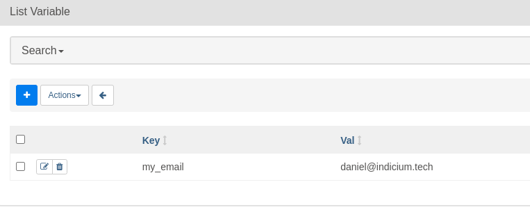

# Desafio Airflow

Esse desafio é parte do programa da trilha "Orquestração com Airflow" e é pré-requisito para obtenção da competência de nível Trainee em Airflow.

# Instruções
Siga as instruções abaixo para poder realizar o desafio corretamente.

> As instruções utilizam comandos do Linux. Usuários do Windows deverão procurar comandos correspondentes.

## 1. Clonando o repositório

O primeiro passo é clonar o repositório para um novo repositório no seu computador:

```
git clone git@bitbucket.org:indiciumtech/airflow_tooltorial.git
cd airflow_tooltorial
```

## 2. Instalar o Airflow

Utilize as instruções no README do `Airflow_tooltorial` para instalar o Airflow na sua máquina. Se tudo der certo, você deve ter uma pasta `airflow-data` dentro da sua pasta de trabalho. Crie uma pasta `dags` dentro desta pasta onde você irá salvar o seu DAG do desafio. Você deve ter uma estrutura de pastas neste formato:

```
├── airflow-data
│   ├── airflow.cfg
│   ├── airflow.db
│   ├── airflow-webserver.pid
│   ├── dags
│   ├── logs
│   ├── standalone_admin_password.txt
│   └── webserver_config.py
```
## 3. Copie o DAG de exemplo para a pasta DAGs

Para facilitar o seu trabalho, um DAG de exemplo chamado `examplo_desafio.py` está disponível na pasta raiz do projeto. Copie esse DAG para a pasta `airflow-data/dags` e veja se o DAG foi importado corretamente pelo Airflow acessando o [http://localhost:8080](http://localhost:8080). Você deverá ver um DAG chamado `DesafioAirflow`.

## 4. Declarando os Requirements
Lembre que todo módulo Python usado no projeto deve ser declarado em um arquivo `requirements.txt`.

## 5. Construindo o DAG

Nosso objetivo neste desafio é construir um DAG muito simples que lê os dados de uma tabela de um banco de dados, exporta em CSV e realiza uma contagem de Pedidos.

> Dica: Use o PythonOperator ao invés do BashOperator, dessa forma você pode escrever a lógica diretamente no arquivo do DAG utilizando funções Python.

## Instruções:

### 1. Crie uma task que lê os dados da tabela 'Order' do banco de dados disponível em `data/Northwhind_small.sqlite`. O formato do banco de dados é o [Sqlite3](https://www.sqlitetutorial.net/). Essa task deve escrever um arquivo chamado "output_orders.csv".
### 2. Crie uma task que lê os dados da tabela "OrderDetail" do mesmo banco de dados e faz um `JOIN` com o arquivo "output_orders.csv" que você exportou na tarefa anterior. Essa task deve calcular qual a soma da quantidade vendida (*Quantity*) com destino (*ShipCity*) para o Rio de Janeiro. Você deve exportar essa contagem em arquivo "count.txt" que contenha somente esse valor em formato texto (use a função `str()` para converter número em texto). Exemplo de Resultado:

#### **`count.txt`**
``` 
830
```
### 3. Adicione uma variável no Airflow com a `key` "my_email" e no campo "value" adicione seu email @indicium.tech. Exemplo:



### 4. Crie uma ordenação de execução das Tasks que deve terminar com a task `export_final_output` conforme o exemplo abaixo:

```
task1 >> task2 >> export_final_output
```

5. Você deve conseguir rodar o DAG sem erros e gerar o arquivo `final_output.txt` com apenas um texto codificado gerado automaticamente pela task `export_final_output`.
## Arquivos para entrega

Você deve nos enviar os seguintes arquivos:
- Link para o repositório do seu projeto
- Arquivo `final_output.txt`